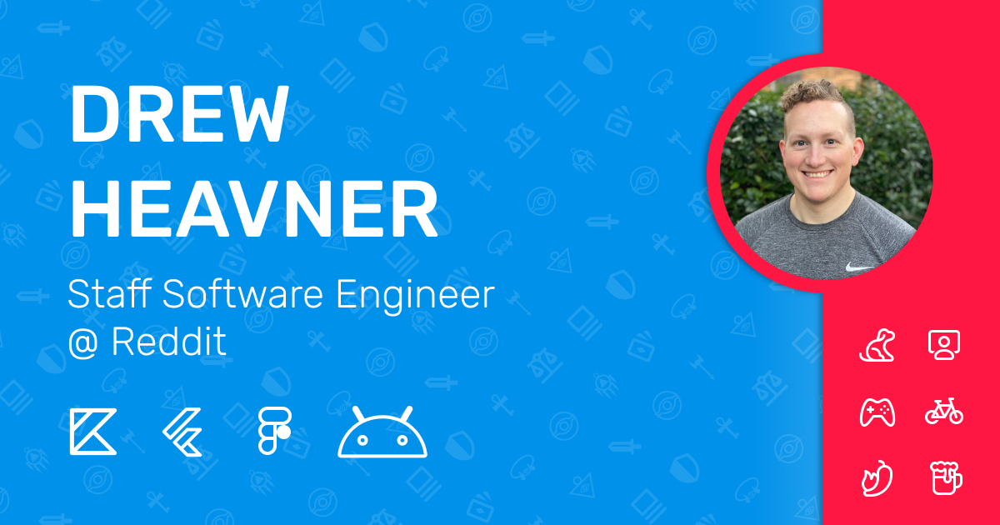

# Hello, I'm Drew 👋🏻 🧑🏻‍💻

I'm currently a Senior Software Engineer @ reddit working to improve their Android app. I am passionate about building high quality **Android** and mobile applications as well as contributing to the world of open-source.

### :computer: &nbsp; Technology 

- Android 
- Flutter
- Firebase
- ReactJS
- Unity3D

### :abc: &nbsp; Languages 

- Kotlin
- Java
- Swift
- Dart
- Typescript
- Javascript
- Python
- C#

### :school: &nbsp; I want to learn & do more ...

- Rust
- Golang
- iOS & More Swift
- Gamedev
- Webdev
- Backend Infrastructure
- Tech Talks
- OSS

### :mailbox_with_mail: &nbsp; How to reach me

- Email: **[veedubusc@gmail.com](mailto:veedubusc@gmail.com)**
- Twitter: **[@r0adkll](https://twitter.com/R0ADKLL)**
- Discord: **r0adkll | Drew#6526**
- Reddit: **[r0adkll](https://www.reddit.com/user/r0adkll)**

# See my work below &nbsp; :arrow_down:

<!--
**r0adkll/r0adkll** is a ✨ _special_ ✨ repository because its `README.md` (this file) appears on your GitHub profile.

Here are some ideas to get you started:

- 🔭 I’m currently working on ...
- 🌱 I’m currently learning ...
- 👯 I’m looking to collaborate on ...
- 🤔 I’m looking for help with ...
- 💬 Ask me about ...
- 📫 How to reach me: ...
- 😄 Pronouns: ...
- ⚡ Fun fact: ...
-->
